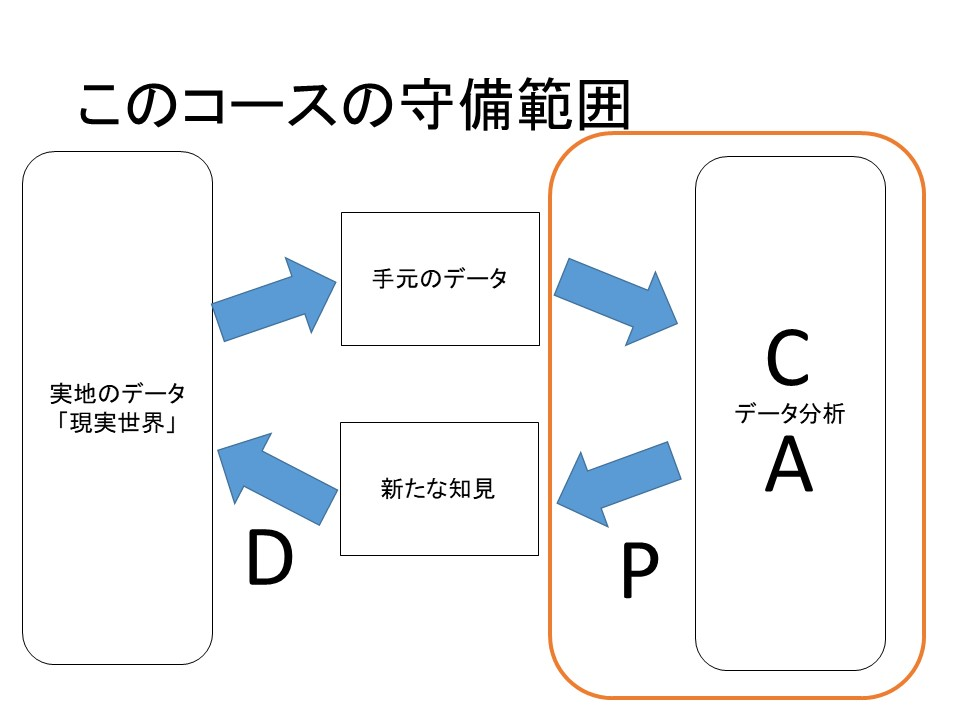
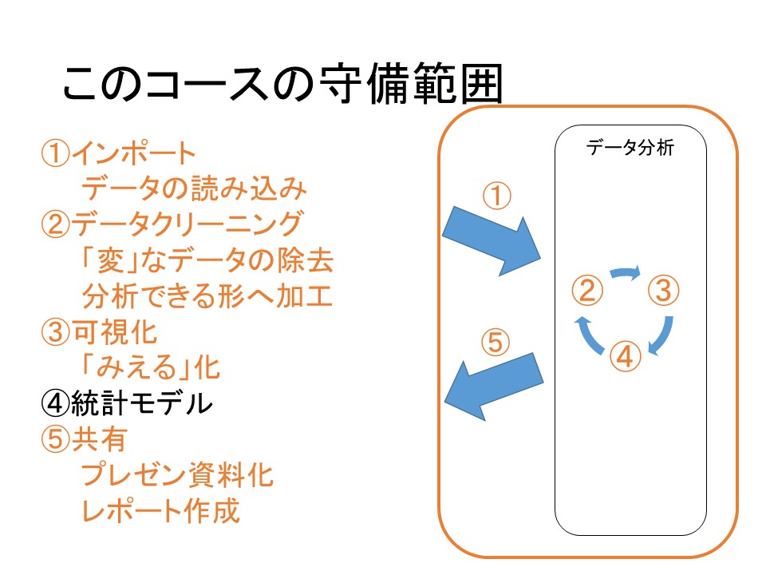

## R言語によるデータ分析入門コースへようこそ！

はじめまして。
本コースを受講いただき、ありがとうございます。

本コースは、手元にあるデータをなんとかして分析できるようになりたいと考えているすべての人を対象としております。

受講にあたって必要なものは、一定程度の情熱とパソコンです。

データを分析するプロセスにおける、このコースの守備範囲は次のようです。

詳しくみてみると、次の5つのプロセスがあります。

本コースでは、これら5つのプロセスのうちの4つを、R言語を用いて、現実的な課題を解決しながら解説を行っていき、受講が終了することには、ある程度、手元にあるデータを加工、可視化して共有できるように皆さんがなることを目標としています。

統計分析については、旧コースの内容を付録としてつけてあります。皆さんの分野によって学ぶべき内容が違うことから、メインのセクションとしては解説しておりません。（尚、別途統計について解説するコースも作成中です）

本コース全体を通してのおことわりです。

本コースは、、「医師が教えるR言語での医療データ分析入門」の内容をアップデートし、内容を追加したものとなります。

もともとは医療職を想定して作成されているコースであるため、例として扱うデータは「医療っぽい」ものが多いです。ただ、本コースで紹介するデータの取り扱い等については、分野を選ばず役立つものであるため、「医療っぽい」例題そのものは大きな問題にはならないと考えます。

（実際、私自身が医療と関係のないログデータやテキストデータ、財務データ、株価データ等を趣味や業務で触れている経験がありますが、本コースで解説する内容
を頻繁に利用します。）

それでは、これから、Rを学ぶ旅をはじめていきましょう！

