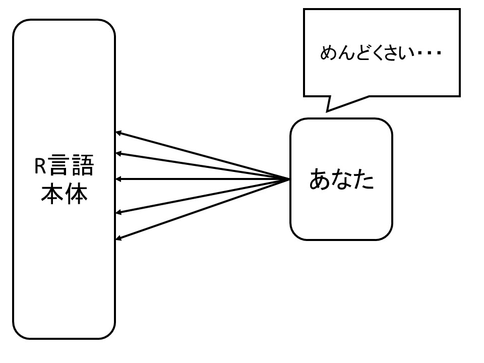
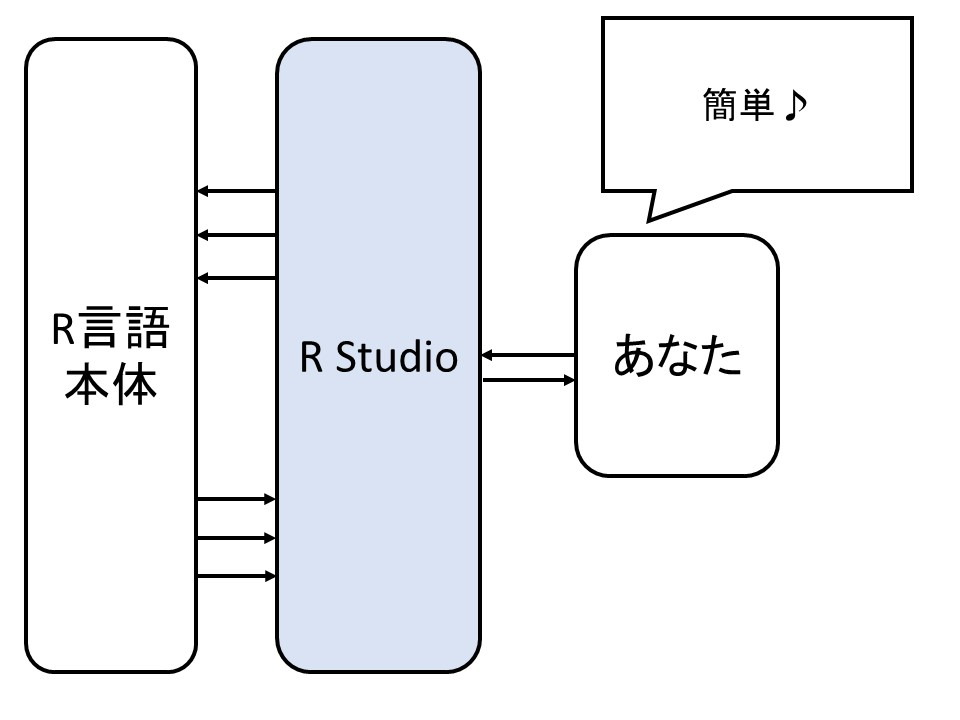

## Rとは?

そもそも、Rとは何かという話を簡単にすると、統計分野が得意な「プログラミング言語」です。プログラミング言語なので、それ単独では非常にとっつきにくいです。なので、

**R Studio**とよばれる、Rを支援してくれるソフトウェアを利用します。これまで、EZRというソフトを使ったことがある人にとっては、EZRの代わりにR Studioを利用するというイメージをもっていただくとよいかもしれません。

イメージとしては、直接R言語を操作する場合はこんな感じで、R本体にたくさん命令を与えなければうまく動いてくれないため、操作が非常にめんどうな形になります。

そこで、その「面倒くささ」を解消するために、間にR Studioを入れます。R Studioが良い感じに間をとりもってくれるため、R本体を直接操作するのと比較してかなり楽になります。

Rが、これから学ぶプログラミング言語そのもののことをさして、R Studioは、そのR言語を簡単に操作するために利用するソフトウェアという形です。

ということで、このRとR Studioをインストールしていきましょう。
