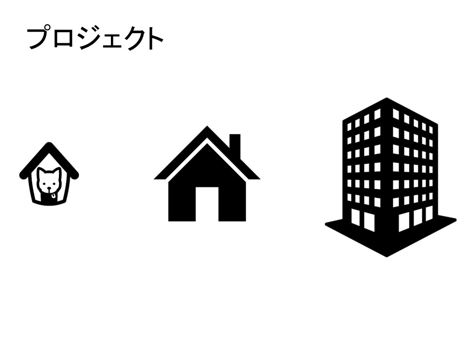
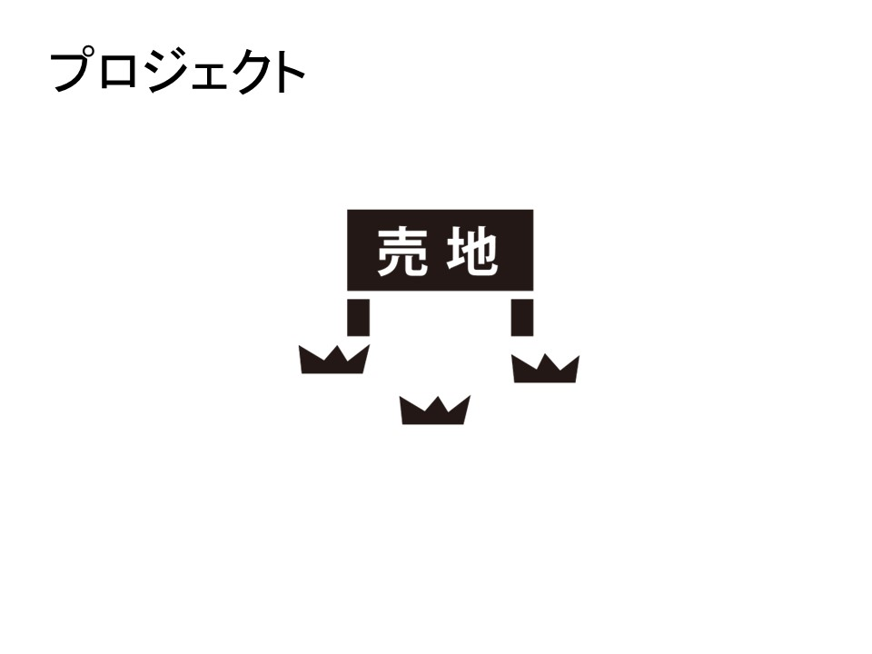
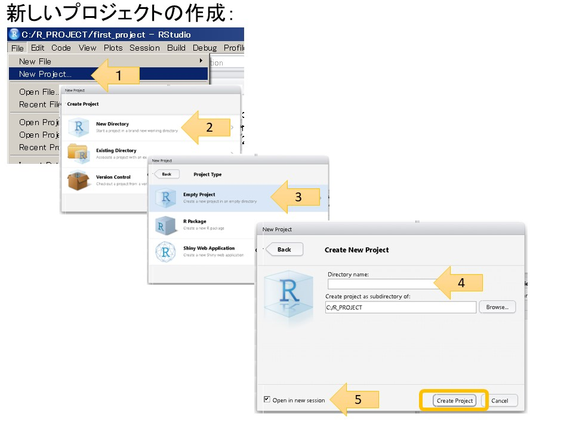

## プロジェクトって？

どんどんRについて勉強をこれから進めていく、その前に。プロジェクトという概念をここで説明させてください。

プロジェクトという単語を聞いていただいた場合にイメージしてほしいのが、1つの「建物」です。

一口に建物といっても、目的に応じて色々ありますね？

木材を使って犬小屋が必要な場合もあれば、色々な材料をつかって、人が住める家が必要な場合、高層ビルが必要な場合もあるかもしれません。

プロジェクトは、こういった建物を建てるための土地を確保するようなイメージです。

プロジェクト単位で、作りたいRのプログラムをどんどん作っていくことで、知らない間に他の建物の天井に犬小屋を建てていたというような状況をさけることができます。

それでは、プロジェクトを実際のRStudioの画面で作成していきましょう。

