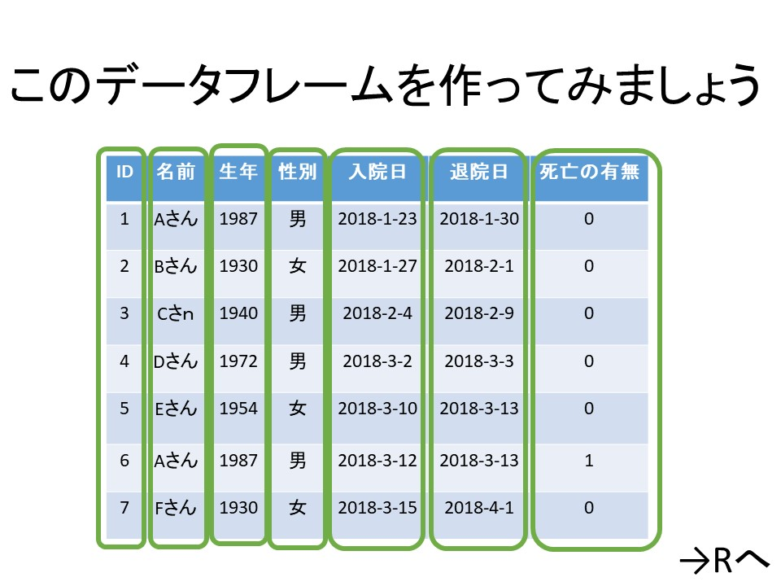
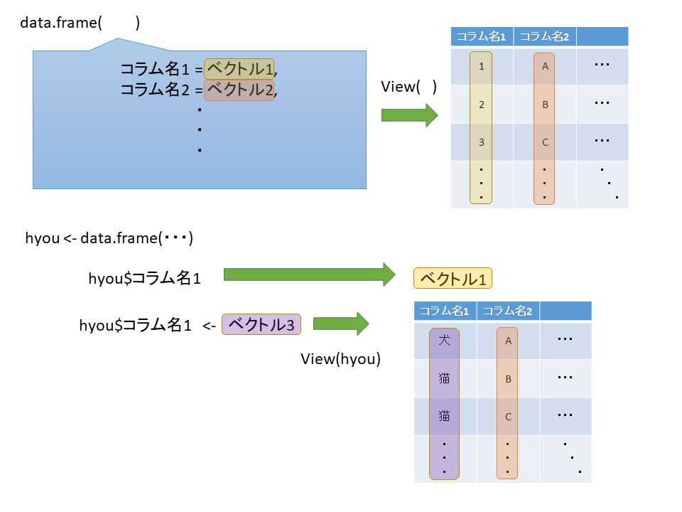

## 課題

この動画はまるまる課題です。
これまでの知識を利用して、



の表を作成してみましょう。それでは、動画をとめてどうぞ！


## 解答:


作成方法その1:

色々な方法が考えられますが、

```{r}
vec_id     <- c(1:7)
vec_namae  <- c("A","B","C","D","E","F","G")
vec_by     <- c(1987, 1930, 1940, 1972, 1954, 1987, 1930)
vec_gender <- c("男","女","男","男","男","女","男")

vec_admission <- c("2018-1-23", "2018-1-27", "2018-2-4",
                   "2018-3-2","2018-3-10","2018-3-12",
                   "2018-3-15")
vec_discharge <- c("2018-1-30", "2018-2-1", "2018-2-9",
                   "2018-3-3","2018-3-13","2018-3-13",
                   "2018-4-1")

vec_is_dead <- c(0,0,0,0,0,1,0)
```

という具合にベクトルを作ってあげて、

```{r}
hyou <- data.frame(
  id = vec_id,
  name = vec_namae,
  seinen = vec_by,
  seibetu = vec_gender,
  admission_date = vec_admission,
  discharge_date= vec_discharge,
  is_dead = vec_is_dead
)

View(hyou)
```

という作り方がシンプルでわかりやすいかもです。
あるいは、

```{r}
hyou <- data.frame(id = vec_id)
hyou$id <- vec_id
hyou$name <- vec_namae
hyou$seinen <- vec_by
hyou$seibetu <- vec_gender
hyou$admission_date <- vec_admission
hyou$discharge_date<- vec_discharge
hyou$is_dead <- vec_is_dead

View(hyou)
```

こんな感じで、＄記号を使って作成することも可能です。


おつかれさまでした！
初めての、「それっぽい」データフレームですね。


データ分析では、複数のデータフレームをくっつけたり、加工したり、抽出したりして、形を整えてから分析します。


実は、作業時間の8割くらいは、このデータの形を整えることについやされるという話もあり、データ加工に習熟することは、データ分析の基本でありながら、かなり大切な素養でもあります。

データフレームの作成を振り返っておきましょう。



次からは、「パッケージ」についての説明です。
