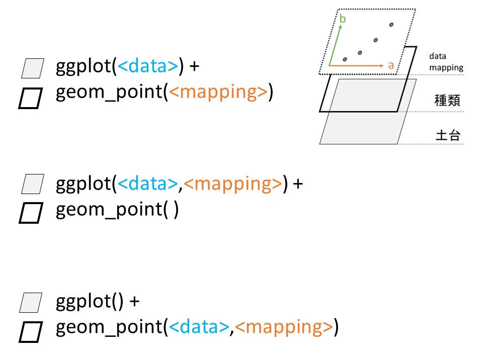

 Lec: -----------------

ここからは、スライドで解説したcolor, shape, fill等を利用してグラフに色や形を設定していく過程を確認していきましょう

```{r}
library(tidyverse)
```

ひとつ前のトピックの課題からスタートします。

Q1: ダイヤモンドの重さと値段の関係を、散布図で描画してください。

```{r}
ggplot(data = diamonds) + 
  geom_point(mapping = aes(x = carat, y = price))
```

これだけだと、ただのなんとなく右肩上がりのグラフです。ここで、同じ重さでも、値段に開きがありそうなことが見て取れます。

ここで、この値段の開きがカットに影響されていると考えると、

```{r}
ggplot(data = diamonds) + 
  geom_point(
    mapping = aes(x = carat, y = price, color = cut)
  )
```

こんな感じのグラフになりました。

また、ダイヤモンドの透明度はどうでしょうか?

```{r}
ggplot(data = diamonds) +
  geom_point(
    mapping = aes(x = carat,y = price, color = clarity)
  )
```

なんか意味ありそうですね。　色もみて見ましょう

```{r}
ggplot(data = diamonds) + 
  geom_point(
    mapping = aes(x = carat,y = price,color = color)
  )
```

こっちも関係ありそうですね。

ここで、ちょっと補足です



このように、実はdataとmappingはggplotの中においてもOKですし、geom関数の中においても大丈夫です。

mappingは、＋以降のgeom関数にその効果は続きます。

なので、うえの例のようにほぼ同じグラフをたくさん書いて探索的なデータ可視化を行う場合は、次のように書いてもOKです

```{r}
gg <- ggplot(
  data = diamonds, 
  mapping = aes(x = carat,y = price)
)

gg + geom_point()
gg + geom_point(mapping = aes(color = cut))
gg + geom_point(mapping = aes(color = clarity))
```

さらに、argumentが指定されていない場合、ヘルプファイルの順番通りに記載されていると解釈されるため、data= mapping=部分は省略できるため、

```{r}
gg <- ggplot(diamonds, aes(carat, price))
gg + geom_point()
gg + geom_point(aes(color = cut))
```

という風に簡略できます。

Q2: ダイヤモンドの色と値段の関係を、箱ひげ図で描画してください。

```{r}
library(ggplot2)

ggplot(data =diamonds) +
  geom_boxplot(mapping = aes(x = color, y = price))
```

これも、色と値段に何かしらの関係がありそうです。他の変数で色分けしてみましょう

```{r}
ggplot(data = diamonds) +
    geom_boxplot(mapping = aes(x = color, 
                               y = price, 
                               color = cut))
 
ggplot(data = diamonds) +
   geom_boxplot(mapping = aes(x = color,
                              y = price,
                              color = clarity))
 
```

colorでなくてfillを使うと、

```{r}
ggplot(data = diamonds) +
  geom_boxplot(mapping = aes(x = color, 
                             y = price, 
                             fill = cut))

ggplot(data = diamonds) +
  geom_boxplot(mapping = aes(x = color,
                             y = price,
                             fill = clarity))
```

colorとfillの違い、OKですね。

colorは箱ひげ図の線に色を規定して、fillは中身に色を設定します。

もちろん、両方使うことも可能で、

```{r}
ggplot(data = diamonds) +
  geom_boxplot(mapping = aes(x = color,
                             y = price,
                             fill = clarity,
                             color = clarity))
```

ここまでのグラフ、なるべく省略してかくとすると、こんな感じです。

```{r}
gg <- ggplot(diamonds, aes(color, price))

gg + geom_boxplot(aes(color=cut))
gg + geom_boxplot(aes(color=clarity))

gg + geom_boxplot(aes(fill=cut))
gg + geom_boxplot(aes(fill=clarity))

gg + geom_boxplot(aes(fill=clarity, color = clarity))
```

Q3:　ダイヤモンドの透明度と色の関係を、何らかの形で描画してください

ここからは全部省略して書いていきます。

```{r}
gdia <- ggplot(data = diamonds)

gdia + geom_count(aes(clarity, color))
gdia + geom_jitter(aes(clarity, color))
```

```{r}
gdia + geom_jitter(aes(clarity, color, color = cut))
gdia + geom_jitter(aes(clarity, color, color = clarity))
   #意味ないですけど
gdia + geom_count(aes(clarity, color, color = cut))

gdia + geom_jitter(aes(clarity, color, color = carat)) 
　 #このように、連続変数も色の濃さで表現されます
```

Q4: ダイヤモンドの値段の分布をヒストグラムにして描画してください

```{r}
gdia <- ggplot(data = diamonds)

gdia + geom_histogram(aes(price))

gdia + geom_histogram(aes(price, color = cut)) #???
gdia + geom_histogram(aes(price, fill = cut))
gdia + geom_histogram(aes(price, fill = clarity))
```

Q5: ダイヤモンドのカットの質が分類毎に、このデータセットに何件ずつあるのかを描画してください。

```{r}
gdia + geom_bar(aes(cut))

gdia + geom_bar(aes(cut, fill = clarity))

gdia + geom_bar(aes(cut, fill = clarity))　
  #これを種類毎に分けたい場合はどうすればいでしょうか？
```

positionというオプションがあるgeom_XXXでは、次のようなことができます。

```{r}
gdia + geom_bar(mapping = aes(cut, fill=clarity), 
                position = "dodge")　
　　　#dodgeはよけるという意味です。
gdia + geom_bar(aes(cut, fill=clarity),
                position = "stack")
```

Q4のヒストグラムも同様です。

```{r}
gdia + geom_histogram(aes(price, fill = clarity), 
                      position = "dodge")
```

のようなことも可能です。

色分けの設定、colorとfillの使い分けについて理解できましたでしょうか?後は形について確認しておきましょう。

diamondsデータだと件数が多くて、形でのデータの区分には不都合なので、ここからはmsleepデータを利用して解説していきます。

脳の重量をx軸、睡眠時間をy軸にプロットすると

```{r}
ggplot(msleep, aes(brainwt, sleep_total)) +
  geom_point()
```

こんな感じです。ちょっと左にデータが偏っていて見にくいので、対数をとる関数、log()を利用してあげて、

```{r}
ggplot(msleep, aes(log(brainwt), sleep_total)) +
  geom_point()
```

見やすくなりました。

ここで、何を主に食べているかを表す変数、voreを利用して、点の形を設定するのであれば、aesの中でshapeを利用してあげて、

```{r}
ggplot(msleep, aes(log(brainwt), sleep_total)) +
  geom_point(aes(shape=vore))
```

こんな感じになります。さらに色をつけてあげると、

```{r}
ggplot(msleep, aes(log(brainwt), sleep_total)) +
  geom_point(aes(shape=vore, color=vore))
```

こんな感じです。

以上、お疲れさまでした。これで色分けと形について説明は終了です。次の動画からは、軸のラベルについて解説していきます

