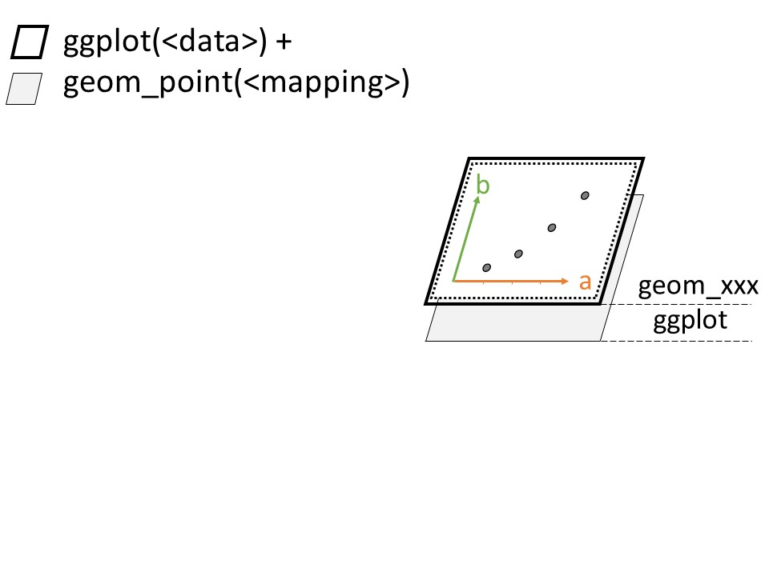
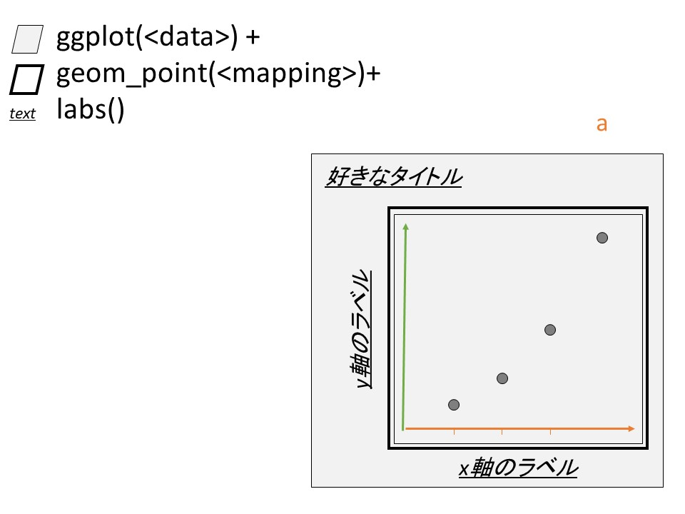
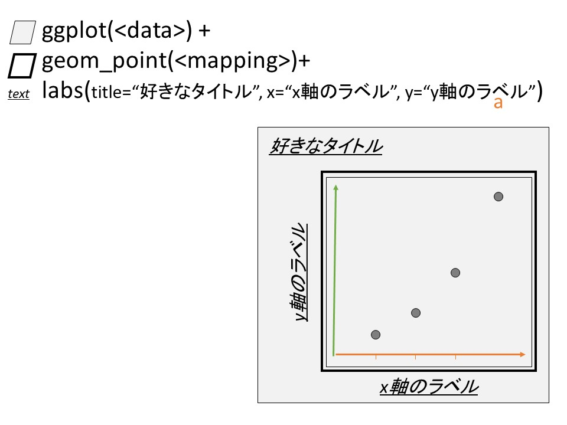

::: {layout-ncol=3}
{group="slides"}

{group="slides"}

{group="slides"}

{group="slides"}
:::


スライドで解説した内容を実施しましょう

```{r}
library(tidyverse)
ggplot(msleep, aes(log(brainwt), sleep_total)) +
  geom_point(aes(shape=vore, color=vore))
```

このグラフに、タイトル、x軸、y軸を設定していきますスライドの通り、

```{r}
ggplot(msleep, aes(log(brainwt), sleep_total)) +
  geom_point(aes(shape=vore, color=vore)) +
  labs(title = "動物の脳の重さと睡眠時間の関係",
       x = "対数変換後の脳の重さ[log(kg)]",
       y = "睡眠時間の長さ[時間]")
```

簡単ですね?
もちろん、変数も使えるので、

```{r}
title_text <- "変数の中のタイトル"
x_lab      <- "変数内のラベルX"
y_lab      <- "変数内のラベルY"

base_graph <- ggplot(msleep, aes(log(brainwt), sleep_total)) +
  geom_point(aes(shape=vore, color=vore))

base_graph
```

こんな感じの基本のグラフに対して、

```{r}
label_graph <- base_graph +
  labs(title=title_text, x=x_lab,y=y_lab)
```

labsでタイトル等をつけてあげて、

```{r}
label_graph
```

こういう風に作成することもできました。いかがでしょうか？ここはそれほど難しくないはずです。

次は、凡例の設定について解説していきます。多分、ggplotでのグラフ作成で一番ややこしい部分かもしれません。

