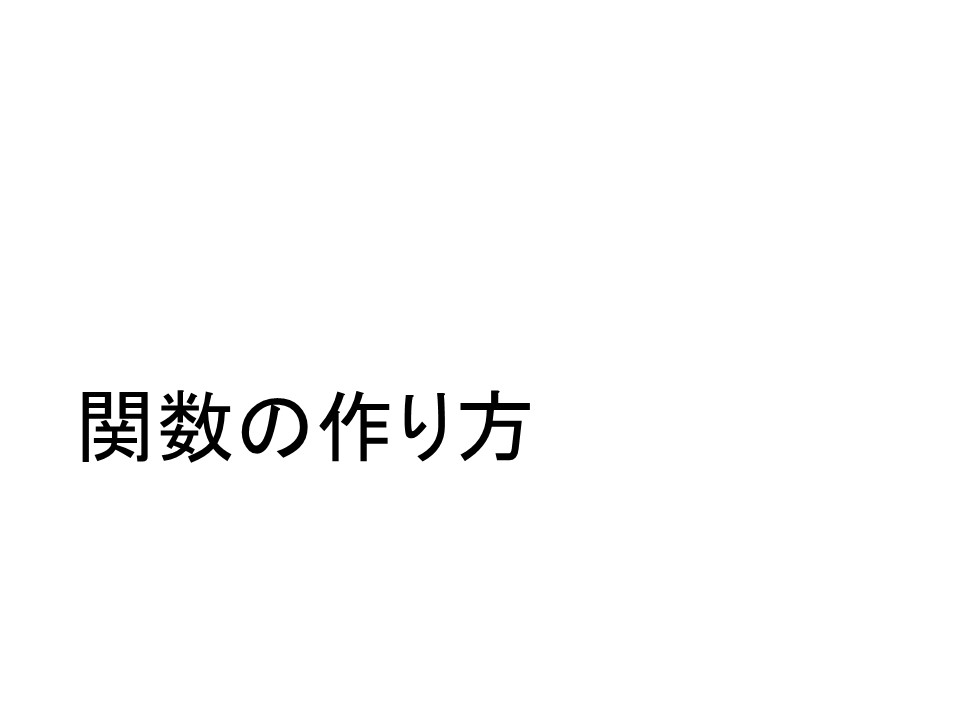
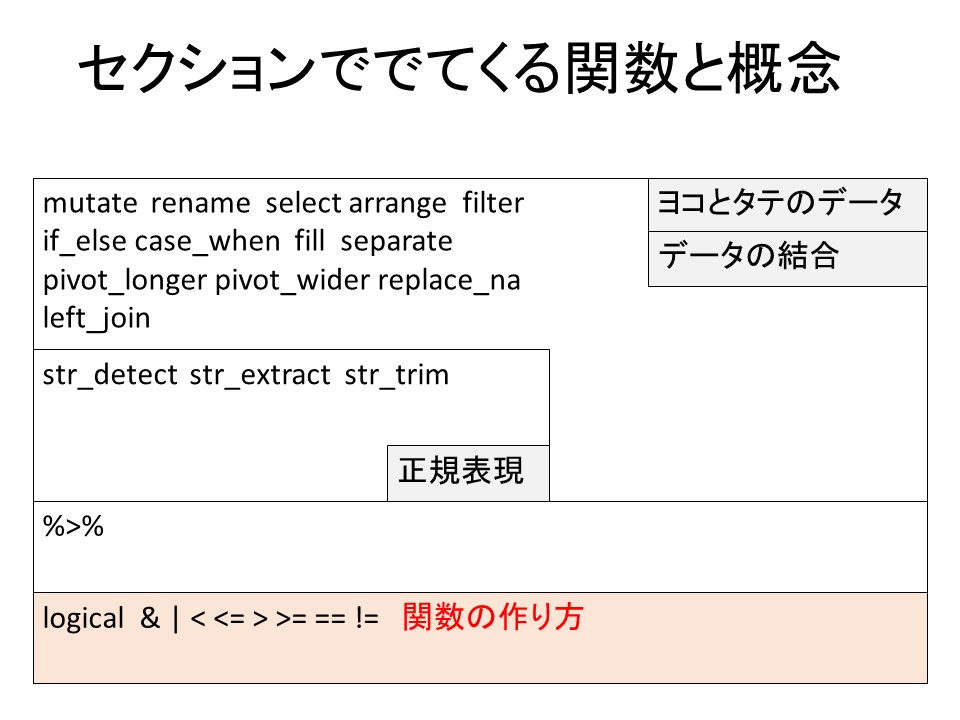

::: {layout-ncol=3}
{group="slides"}

{group="slides"}
:::

ここまでで関数の使い方についての解説をたくさん行ってきましたが、関数の作り方については解説していませんでした。

慣れてきて、自作関数等をつくれるようになれば、Rの世界が広がるのですが、ここでは、次に説明するパイプ関数の働きを理解するために基礎の基礎だけ解説させていただきます。


関数をつくるためには、function関数という関数そのものの名前がついた関数を利用します。

たとえば、kansu1という名前の関数を作成したくて、その機能が数値を一つ受け取って10倍するというものであれば、

```{r}
kansu1 <- function(num){
  return(num*10)
}
```

kansu1への代入を実行すると、Environmentにkansu1が表示されてfunctionsであるとでています。

環境中にすでにあるので、

```{r}
kansu1(3)
kansu1(3.45)
```

と、こんな感じで実行されました。

ちゃんと与えた数字が10倍になった結果が帰ってきていますね？

また、例えば100倍にした文字列型を返すという場合であれば、

```{r}
kansu2 <- function(korewo100bai){
  temp <- korewo100bai * 100
  temp <- as.character(temp)
  return( temp )
}


kansu2(234.32)
kansu2(1.23)
```

ちゃんと100倍して文字列型に変換されています。

こんな感じで、

<関数名> <- function(<アーギュメント>){
　　＜処理＞
　　return(<処理した結果>)
}

としてあげれば関数の作成ができます。return()は、その関数が返す結果を明示してくれるものになります。returnがなくても、最後の実行結果が返ってくるのですが、他の人が関数を見たときに何が返ってくるか、わかりやすくするためにもreturnは記載するように癖付けておきましょう。

また、アーギュメントには初期値を設定することも可能です。

```{r}
kansu3 <- function(num,baisu=100){
  temp <- num * baisu
  temp <- as.character(temp)
  return(temp)
}
```

このkansu3は、アーギュメントを二つ受け取ります。baisuアーギュメントには初期値100が設定されているため、

```{r}
kansu3(4)
```

一個だけ数字を与えると、自動的にnum=4, bisu=100として100倍された文字列型が返ってきます。

```{r}
kansu3(1.2, 12)
kansu3(num = 1.2, baisu=12)
```

こんな感じでアーギュメントの設定された順番でnum=やbaisu=を指定しない場合は実行されること、感覚的に理解しておいてください。

それでは、次の動画で演習問題を行いましょう。

