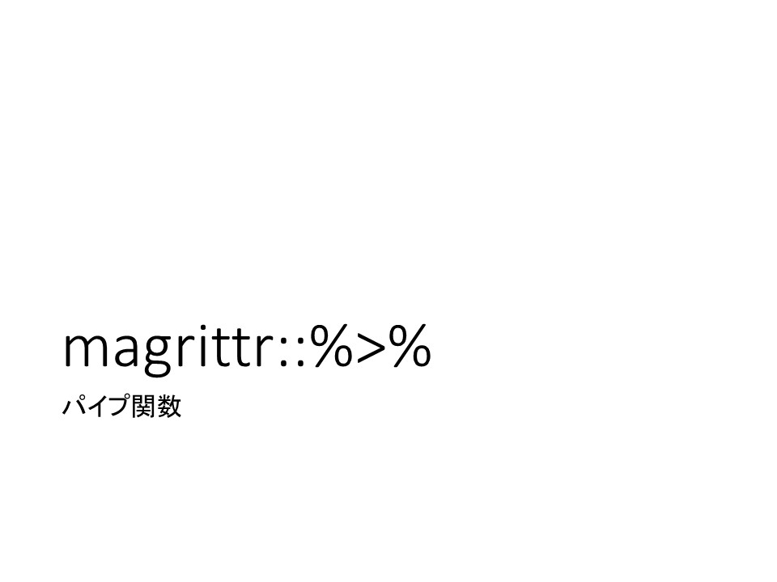
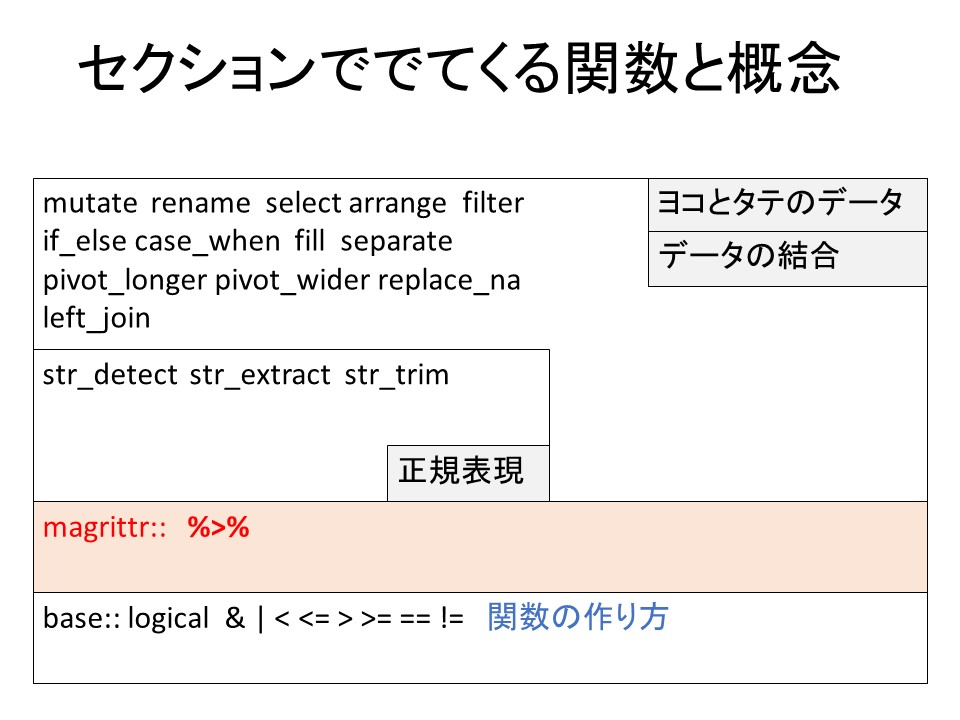
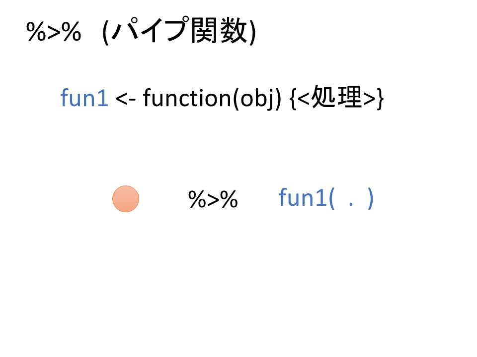

::: {layout-ncol=3}
{group="slides"}

{group="slides"}
:::

ひとつ前の動画で作成した、tasizan関数を少し振り返りましょう。

この関数、

```{r, message=FALSE}
library(tidyverse)
```

```{r}
tasizan <- function(num1,num2){
  return(num1 + num2)
}

tasizan(3,4)
```

で、3+4を実行していました。逆に考えると、

```{r}
3 + 4 #はtasizan(3,4)と同じ意味になります。
```

実際に、関数を()抜きで描くとその関数の処理をみることができます。

```{r}
tasizan
```

これは、1つ前の動画で作成した関数なので、皆さんがタイプしたものと一緒ですね。実は+,-,*等の、記号も「関数」です。

``(バッククオート)でくくってあげると、

```{r}
`+`
`-`
`*`
`/`
```

と何らかの関数であることがわかります。`-`関数について、その動きをみてみると、

```{r}
4 - 3
```

と書くことで、-記号の前の数字から後の数字を引くというような動作をしていることがわかります。

このように、皆さんはすでに「記号」がその前後の値を自動的に関数に取り込んで処理するというものに出会っています。

それで、本題なのですが、ctrl+shift+mをwindowsの方は押してみてください。

(macの方は + shift + m)

 %>% <- こんな記号がでてきましたか?（もし、ここで |> という記号がでてきた場合は、本コース作成中にRに組み込まれた新しいパイプ記号です。%>%とほぼ同じように使えますが、一部仕様が違う部分もありますので、native pipeについての補足動画で補完してください）
 
これが、パイプ関数とよばれる関数です。
 
このパイプ関数の動作のイメージを確認しましょう:


::: {layout-ncol=3}

:::
 
では実際にみていきます。

```{r}
hikizan <- function(num1,num2){
  return(num1 - num2)
}

kakezan <- function(num1, num2){
  return(num1 * num2)
}

hikizan(10,5)
```

で考えると、

```{r}
10 %>% hikizan(. , 5) # hikizan(10,5)
5  %>% hikizan(10, .) # hikizan(10,5)
```

この二つは全く同じ処理です。パイプ関数がパイプの前の値をパイプの後ろの関数に「.」で指定した場所にわたされて処理が実施されていますね?

こんな風にパイプが1個だと、何がやりたいか分かりにくいと思いますが、関数の実行結果を次々とパイプに渡していくｔなにが起こるかを見てみましょう。

```{r}
100 %>% 
  hikizan(., 7) %>% 
  hikizan(., 7) %>% 
  tasizan(., 20) %>% 
  kakezan(., 0.1)
```

この計算結果、10.6になりましたが、これは、

100から
　7を引いて、その結果から
　7を引いて、その結果に
　20を足して、その結果に
　0.1をかける。
処理となります。

この処理、すごく単純に見えますが、関数のみを使ってかこうとすると、結構ややこしいです。

```{r}
kakezan(tasizan(hikizan(hikizan(100,7),7),20),0.1)
```

どうでしょうか?

関数が処理結果を()の中にいれないといけない関係上、一番内側にある関数から処理がおこなわれてさらに、()が多量にお互いの内側にある（「ネストしている」）ので、ぱっと見ただけでは処理を把握するのが厄介です。

```{r}
100 %>% 
  hikizan(., 7) %>% 
  hikizan(., 7) %>% 
  tasizan(., 20) %>% 
  kakezan(., 0.1)

kakezan(
  tasizan(
    hikizan(
      hikizan(
        100,7),
      7),
    20),
  0.1)
```

改めて、パイプ関数で処理を書く方が

* 処理の順番に記載ができる
* ()がネストしない

ため、見通しがよいですね?

このパイプ関数、次からご説明する関数群を利用して

 <表データ> %>% 
   <表に新しい列を足す> %>% 
   <表の列Aが100以上の場合に絞り込む> %>% 
   <表の欠損しているデータを別の数値に変換する>
 
などのように、データクリーニングのプロセスを分かりやすく表示できるメリットがあるので今後、本セクションで多用します。
 
それでは、次の動画でパイプ関数の入力の練習をしておきましょう。

