::: {layout-ncol=3}
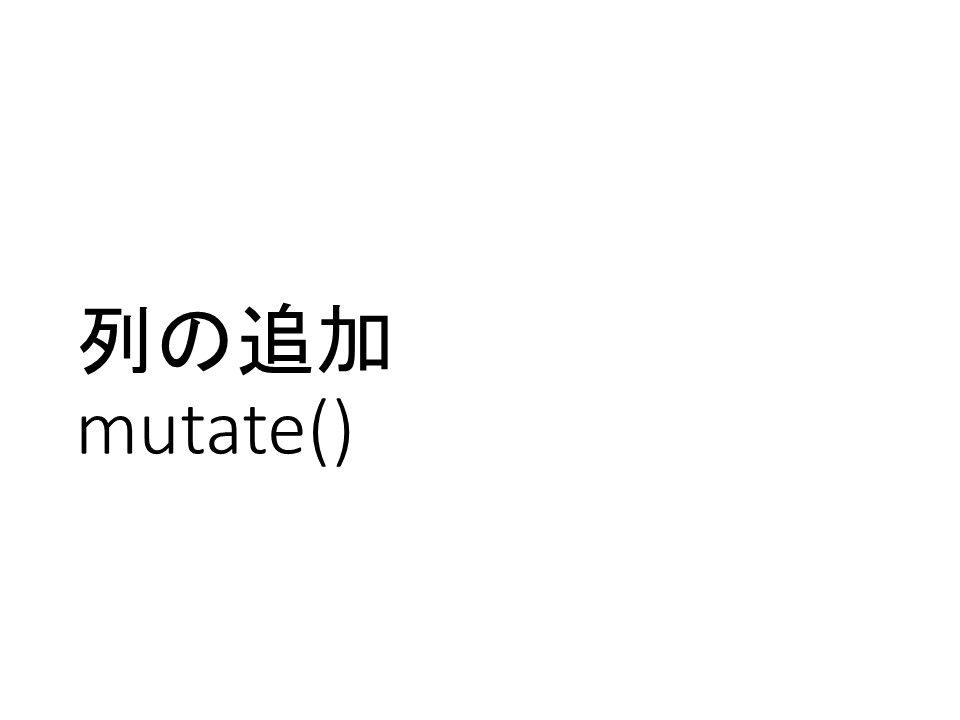{group="slides"}

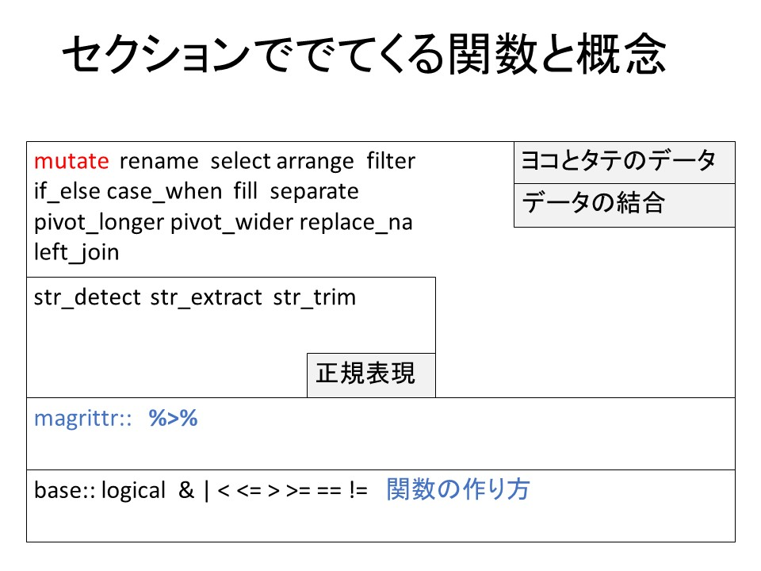{group="slides"}

{group="slides"}

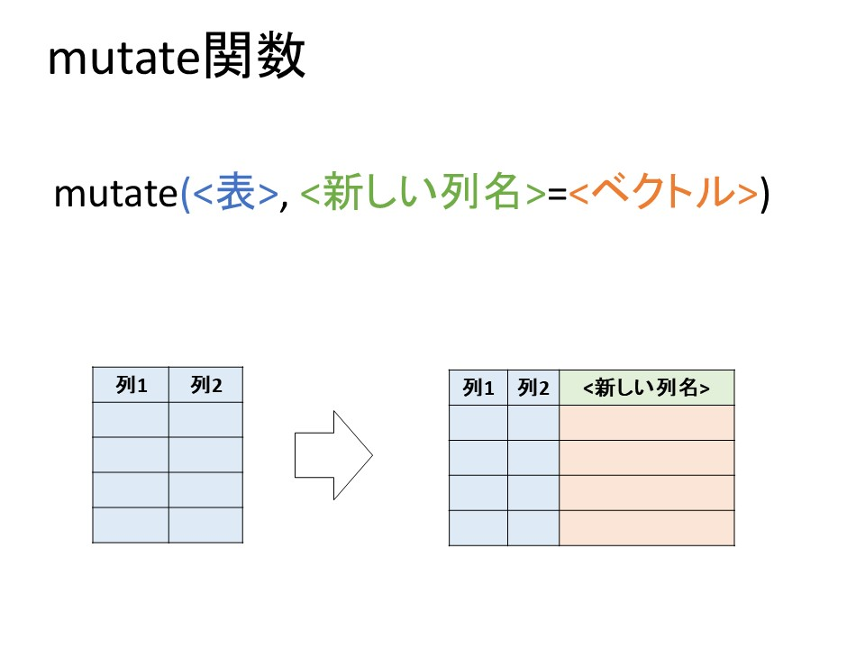{group="slides"}

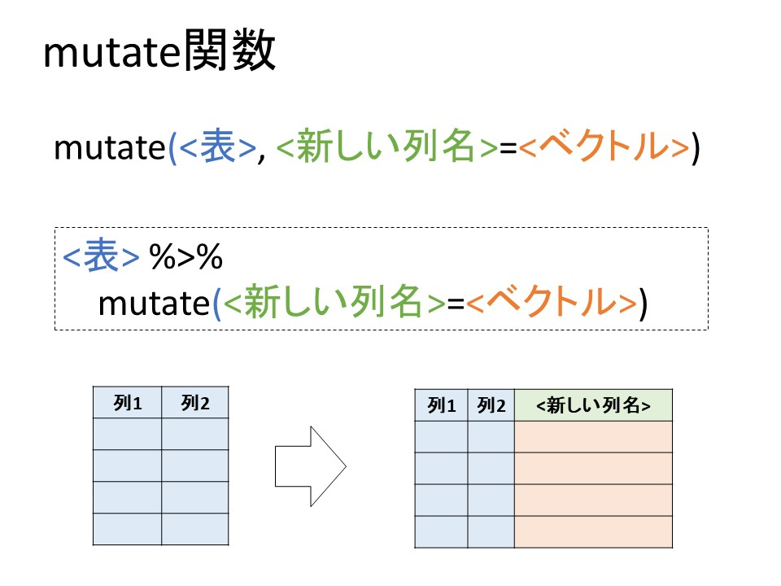{group="slides"}

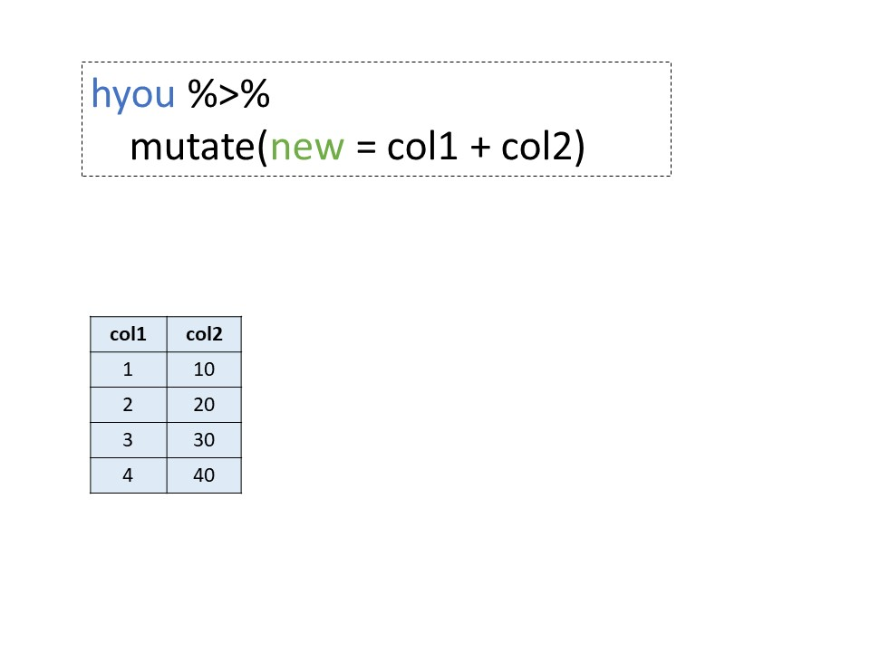{group="slides"}

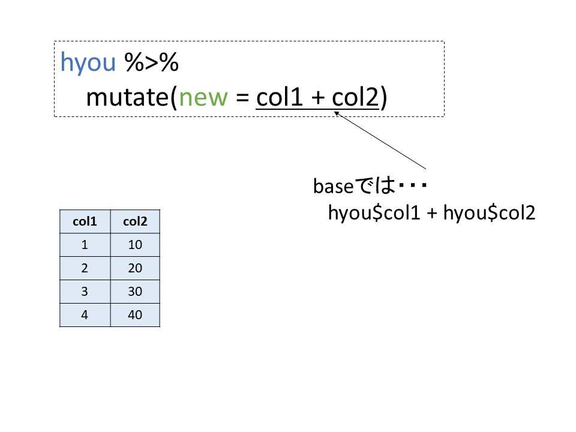{group="slides"}

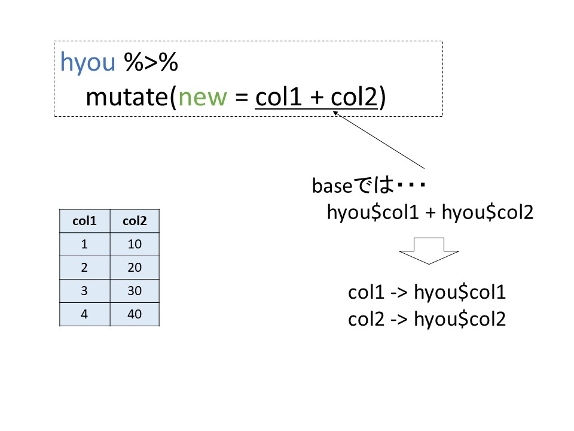{group="slides"}

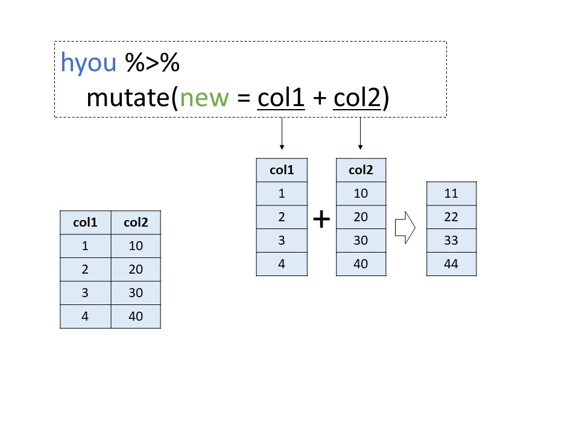{group="slides"}

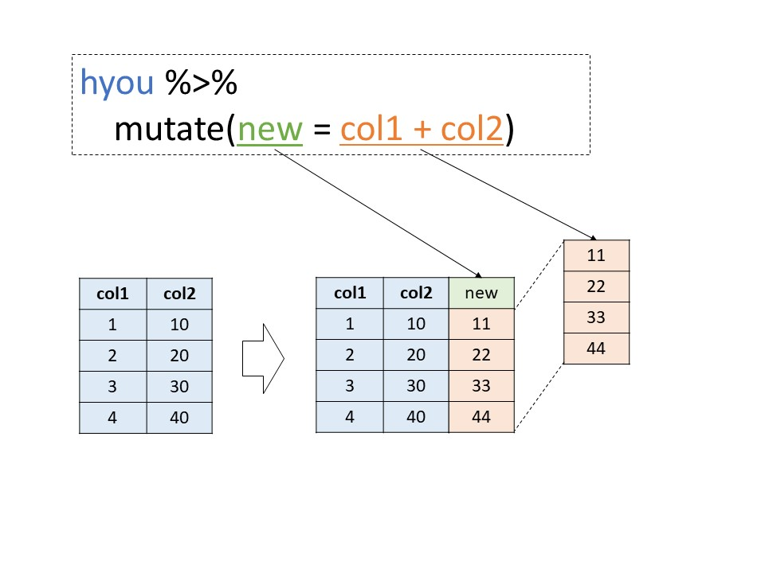{group="slides"}

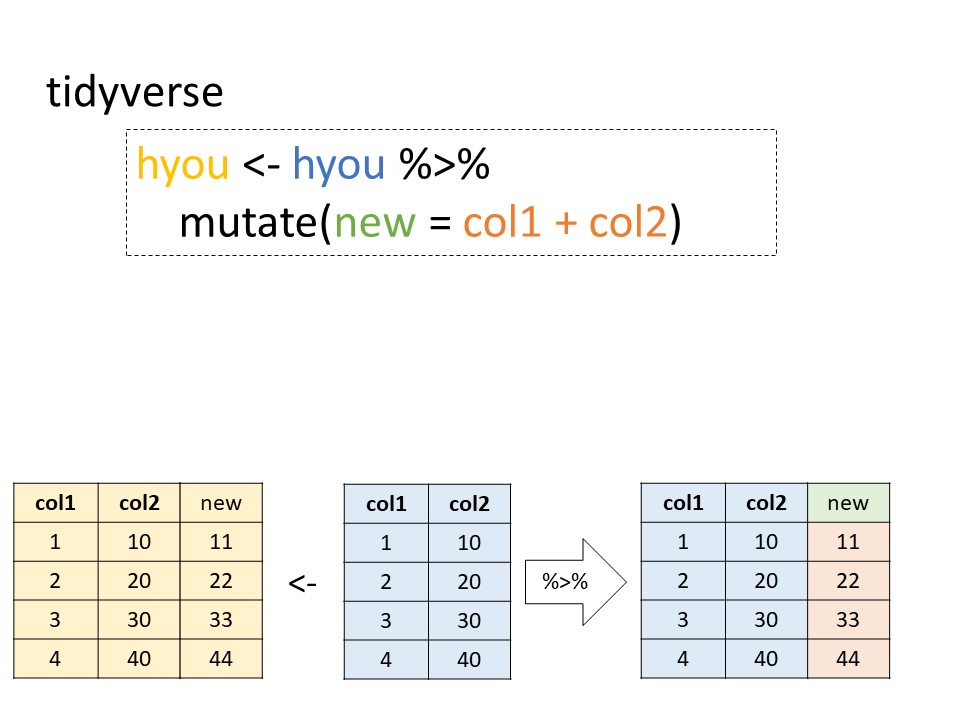{group="slides"}

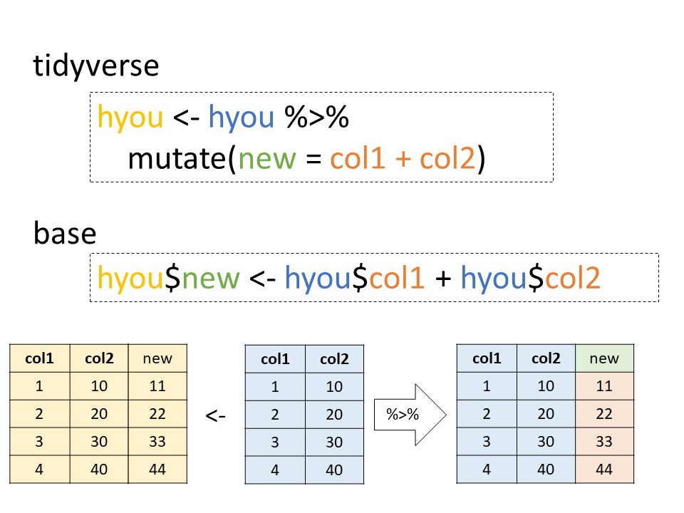{group="slides"}
:::

