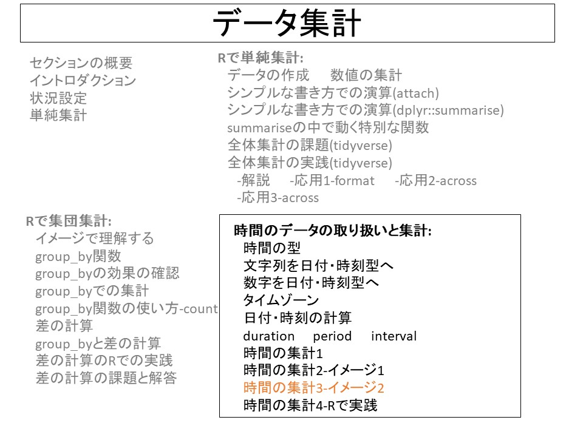
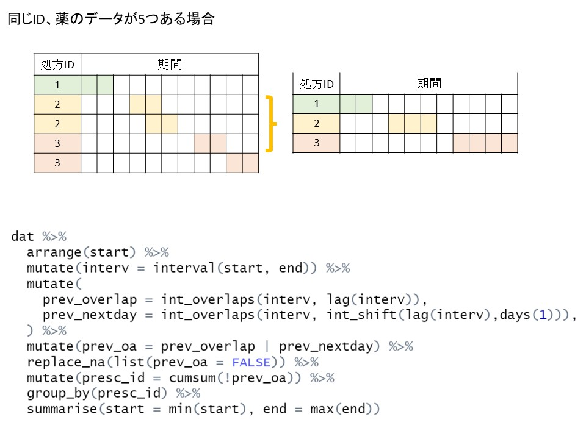
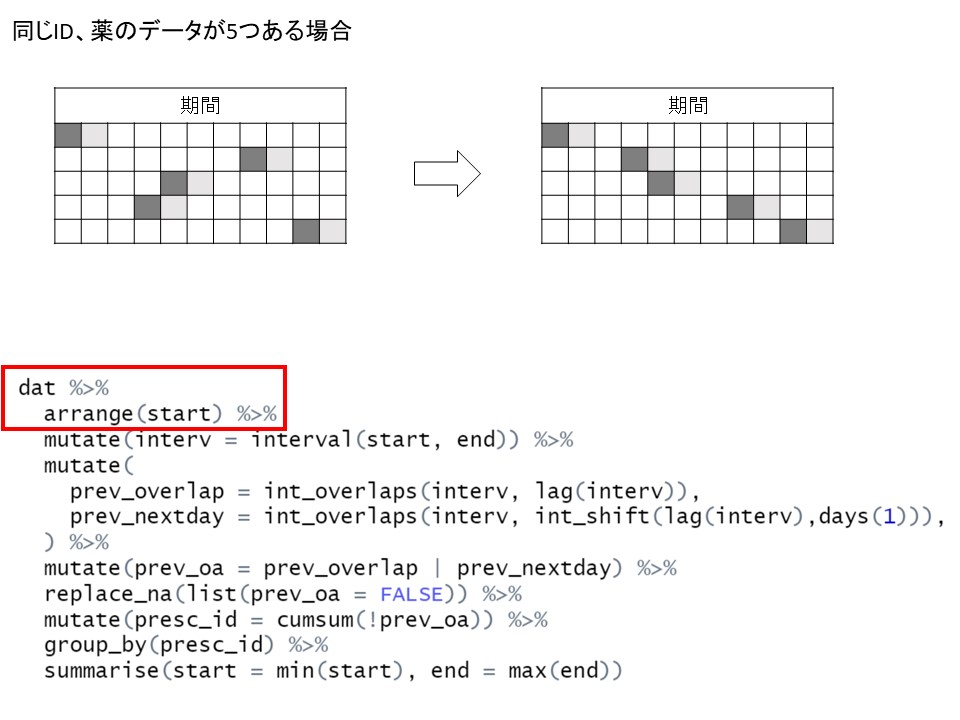
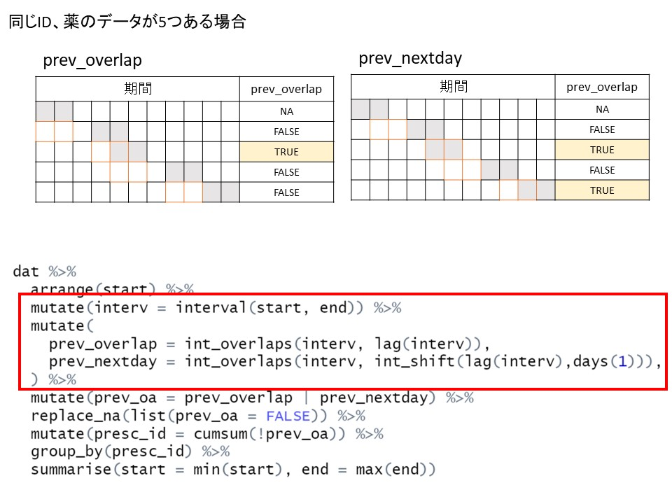
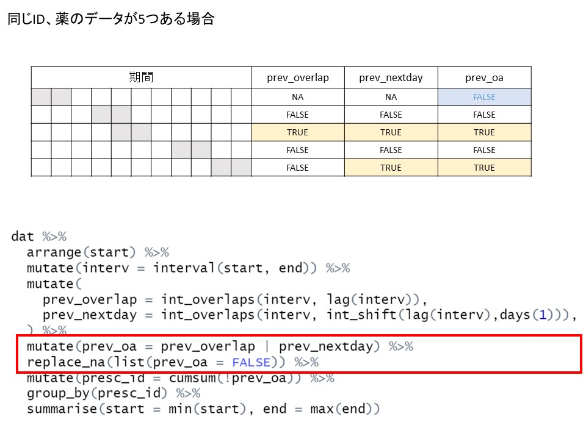
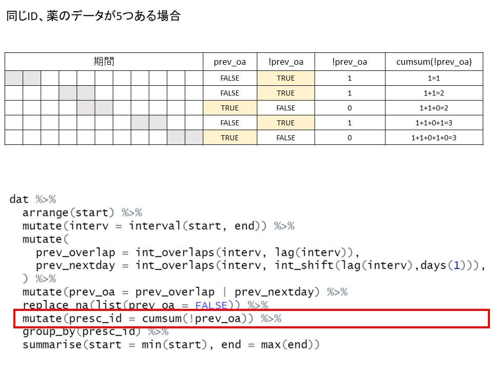
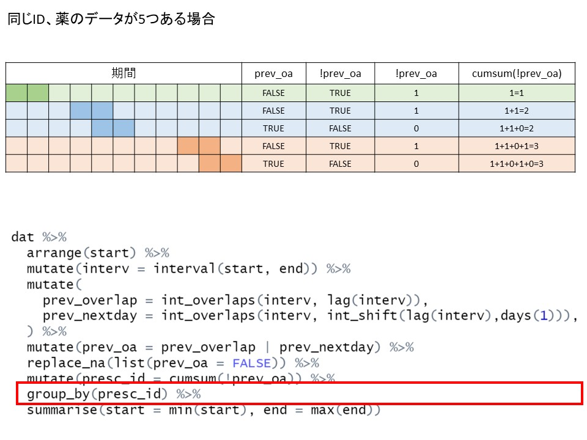
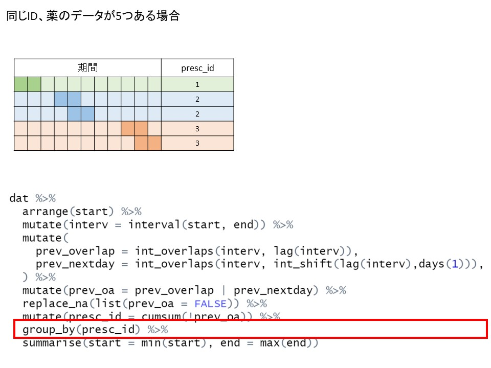
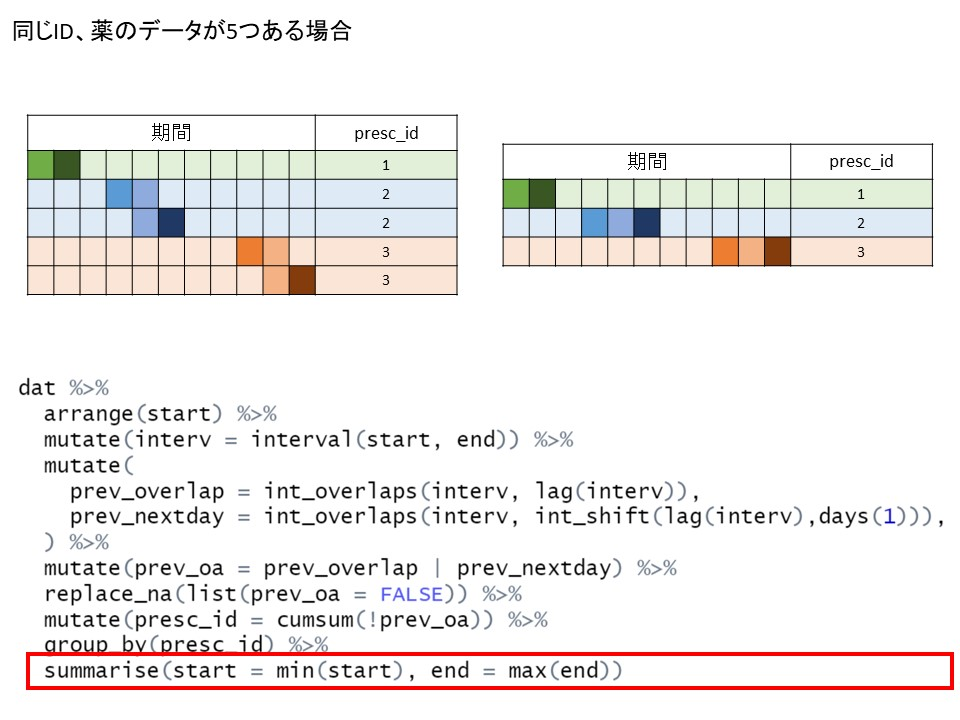

::: {layout-ncol=3}
{group="slides"}

{group="slides"}

{group="slides"}

{group="slides"}

{group="slides"}

{group="slides"}

{group="slides"}

{group="slides"}

{group="slides"}
:::


```{r, message = FALSE}
library(tidyverse)
library(lubridate)
```

```{r}
{
  dat <- read_csv("data/time.csv")
  
  dat <- dat |> 
    slice(1:5) |> 
    select(start,end)
  
  dat %>%
    arrange(start) %>% 
    mutate(interv = interval(start, end)) %>% 
    mutate(
      prev_overlap = int_overlaps(interv, lag(interv)),
      prev_nextday = int_overlaps(interv, int_shift(lag(interv),days(1))),
    ) %>%
    mutate(prev_oa = prev_overlap | prev_nextday) %>% 
    replace_na(list(prev_oa = FALSE)) %>% 
    mutate(presc_id = cumsum(!prev_oa)) %>%
    group_by(presc_id) %>% 
    summarise(start = min(start), end = max(end))

  
}
```
